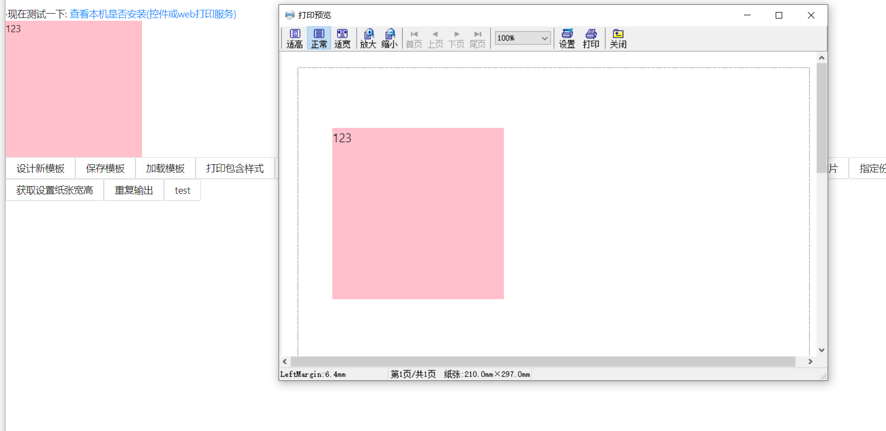
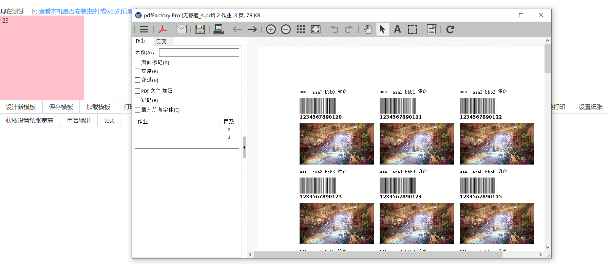

## 🎨 LODOP DEMO

本项目主要提供一些常用的 lodop 使用技巧和思路。

* **Design**，**Save** and **load** templates（eg：label） 
* Print with **CSS** style
* Get and Set **pagesize**，**printer**
* Print **PDFs**，**Images**
* Print-items is **repeated** on papers
* **Paging**-print（分页）
* **Slicing** tasks to improve **performance**


## 🚀 Quick start

```
npm install
npm start
```


## 🌈 Screenshot

**Print with CSS style**



**Print-items is repeated on papers**


